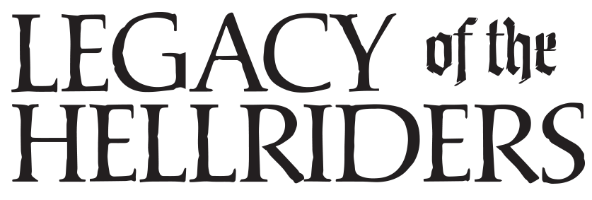



Ah Elturgard! If any place in the world exemplifies
humanity's potential for greatness, it is this nascent
nation. Who could forget the shining sight of a host of its
Companions, paladins all, riding out on the field, banners
taught and snapping, breastplates and shields agleam
with the symbol of Elturgard, and each bearing a holy
symbol of his or her god—armor for the soul. We have
no shortage of the good and the just among my people,
but the sheer zeal and genuine bravado the Companions
have in pursuit of righteousness seems to me something
uniquely human. And it's not just those few touched by
the gods who seek these high ideals; Elturgard's armed
forces swell with men and women who aspire to join
the Companions.
Whenever Baldur's Gate has tried to seize too much
territory in Elturgard's eyes, Elturel has responded by
imposing a heavy tax on shipments headed downriver.
This sort of economic brinkmanship coupled with
radically different religious viewpoints has created bad
blood between the two cities, though neither city has
been eager to test the military might of the other.
Grand Duke Ulder Ravengard of Baldur's Gate has just
arrived to Elturel with an attachment of Flaming Fist.
The reason for the visit is unkown.

## And You are the Hellriders

Each of your characters belongs to the Hellriders. Also
known as the Riders of Elturel, are an elite cavalry
unit who acted as the primary armed force of the city
of Elturel. The Hellriders helped Elturel establish and
maintain civilization in the harsh lands of the Sword
Coast. They are one of the most renowned and wellregarded
military forces in the Realms. It was said
that a company of Riders had once ridden into the
Hells themselves. And from this story, the Hellriders
were named.

## Your Character in the World

[Character creation](charactercreation "title")

## House rules

[House rules](houserules "House rules")

