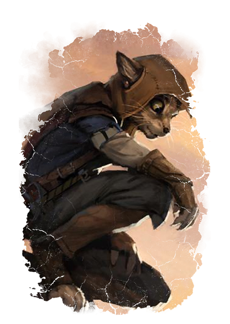
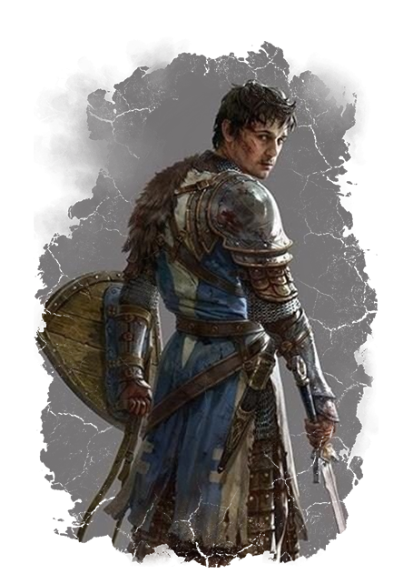
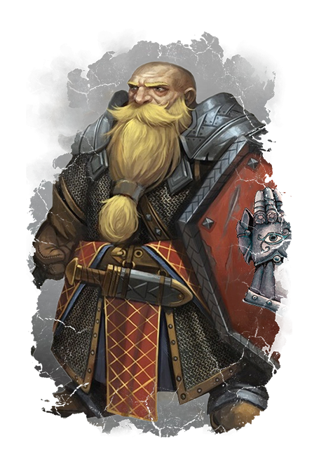
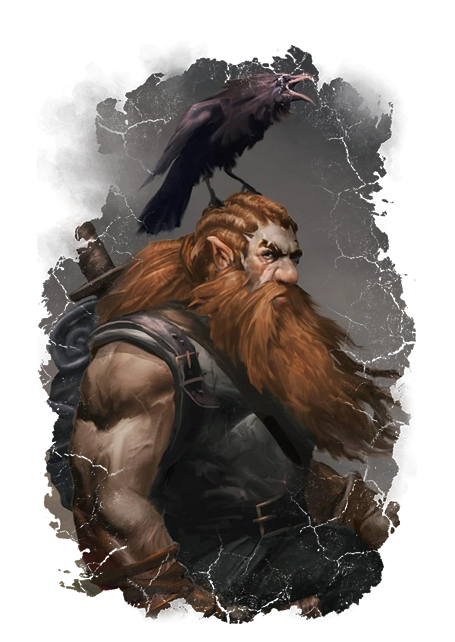
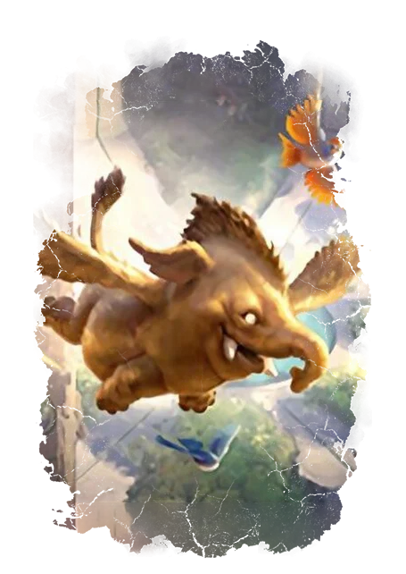

# Einar
Fremføres av Sigurd

For mange år siden fant en Hellrider tropp tre unge tabaxier. De var de eneste overlevende i en karavanen med flykninger som var blitt angrepet.
Einar var sammen med søsteren **Morgenstjerne** og broren **Skyggespill**. Hellriderene førte de i til Mayflower i Elturel der **Vina Krol**, en av de unge jentene som jobbet der, tok omsorg over dem. Vina oppdrog tabaxiene som sine egne, og ble som en mor for dem. Som de Hellrider som reddet søskenflokken, så ønsker Einar å hjelpe de  som er i nød ved å bli med i Hellriders. 

På den skjebnesvanger dagen var Einar og søskene i bryllupet til Vina og **Bertrand Triest**.

# Shang Dol
Fremføres av Roger

Når Shang var 14 år dro faren **Mao** sammen med døttrene **Mien** og **Ina** på handelstur til Iriabor. Bare søsteren Ina kom tilbake, etter at de ble angrepet uten for Elturgards beskyttelse. Shang  følte kallet til å ta bli med i Hellriders når han ble gammel nok. 

Mamma **Heidrun** og Ina er med på innvielsen. Dere er alle uviten hva som snart kommer til å skje.

# Kasmodan Fireforge
Fremføres av Magne

Kasmodan har utallige ganger vært med faren **Thimmiuk** i smia for å lage våpen og rustning til Helleriders og Order of the Companions. Moren din **Gillydd**
fikk såvidt sett deg etter du kom tilbake fra vaktturnusen din før faren din setter deg til å hente mer metall til smia.

Du glemmer aldri det synet som snur alt opp ned.

# Buvil
Fremføres av Steffan

Buvil vokste opp som foreldreløs. Du ble tatt hånd av Hellerider da du var 12 år. Nå er du endelig gammel nok å av gi enden og bli selv en Hellrider. I stedet for foreldrene din, så skal bestevennen din **Reya Mantlemorn** være med deg.

En gledes dag som snart snur seg og biter fra seg.

# Bart
Fremføres av Mads

Det er bare noen år siden du følte kallet å dra sørover til Elturel. Du vet ikke hvorfor denne plassen kalte det på deg, men du føler en tilknytning her. Folken i byen har tatt godt i mot deg, der du fremfør sanger om land og steder fra fremmende strøk. Du merker at Hellridere spesielt liker sangene dine og store slag og helter som vinner og mørkets krefter.

Alt så ut som skulle være en perferkt dag med mange tilreisende da det utenkelige skjedde.

